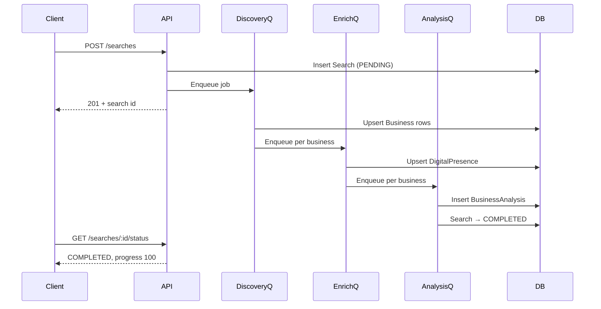

# Business Prospect Finder — Usage Guide

Complete reference for setup, API usage, pipeline behavior, and troubleshooting.

---

## Table of contents

1. [Overview](#overview)
2. [Prerequisites](#prerequisites)
3. [Environment setup](#environment-setup)
4. [Installation & first run](#installation--first-run)
5. [Map GUI](#map-gui)
6. [Authentication](#authentication)
7. [End-to-end workflow](#end-to-end-workflow)
8. [API reference](#api-reference)
9. [Response format](#response-format)
10. [Job pipeline & statuses](#job-pipeline--statuses)
11. [Export formats](#export-formats)
12. [Analytics](#analytics)
13. [Lead scoring & AI output](#lead-scoring--ai-output)
14. [Example session (curl)](#example-session-curl)
15. [Troubleshooting](#troubleshooting)

---

## Overview

Business Prospect Finder discovers local businesses via **Google Places**, enriches their digital presence (emails, tech stack, SSL, social links), scores them as sales leads, and generates AI outreach copy.

```
POST /searches
    → Discovery queue   (Google Places grid search)
    → Enrichment queue  (website scraping & extractors)
    → Analysis queue    (scoring + LLM generation)
    → Search COMPLETED
GET /searches/:id/export
GET /searches/:id/analytics
```

The HTTP server and all three background workers start together (`npm run dev`).

---

## Prerequisites

| Service | Purpose | Recommended provider |
|---------|---------|---------------------|
| PostgreSQL | Persistent data | [Supabase](https://supabase.com) (free tier) |
| Redis | BullMQ job queues | [Upstash](https://upstash.com) (free tier) |
| Google Places API | Business discovery | Google Cloud Console |
| LLM API | Analysis & outreach copy | OpenAI, Gemini, or Claude |

- Node.js **22+**
- No local Postgres or Redis required when using Supabase + Upstash

---

## Environment setup

Copy the example file and fill in your values:

```bash
cp .env.example .env
```

### Variable reference

| Variable | Required | Description |
|----------|----------|-------------|
| `PORT` | No | HTTP port (default `3000`) |
| `NODE_ENV` | No | `development` \| `production` \| `test` |
| `DATABASE_URL` | Yes | PostgreSQL connection string (Supabase direct URL, port 5432) |
| `REDIS_URL` | Yes | Redis URL (`redis://` or `rediss://`) — **not** an HTTPS REST URL |
| `GOOGLE_PLACES_API_KEY` | Yes | Google Places API (New) key |
| `LLM_PROVIDER` | No | `openai` \| `gemini` \| `claude` (default `openai`) |
| `LLM_API_KEY` | Yes | API key for the selected LLM provider |
| `RATE_LIMIT_WINDOW_MS` | No | Rate limit window in ms (default 900000 = 15 min) |
| `RATE_LIMIT_MAX_REQUESTS` | No | Max requests per window (default 100) |
| `SUPABASE_URL` | Yes | Supabase project URL |
| `SUPABASE_JWT_SECRET` | Yes | JWT secret for API token verification |

Client (`client/.env`):

| Variable | Required | Description |
|----------|----------|-------------|
| `VITE_SUPABASE_URL` | Yes | Same project URL |
| `VITE_SUPABASE_ANON_KEY` | Yes | Supabase anon/public key |

### Supabase `DATABASE_URL`

1. Supabase → **Project Settings → Database → Connection string → URI**
2. Choose **Direct connection** (port **5432**)
3. Paste into `.env`

**URL-encode special characters in passwords:**

| Character | Encoded |
|-----------|---------|
| `/` | `%2F` |
| `@` | `%40` |
| `#` | `%23` |
| `:` | `%3A` |

Example: password `abc/def` → `abc%2Fdef` in the URL.

### Upstash `REDIS_URL`

1. Upstash dashboard → your database
2. Copy **Redis URL** (starts with `rediss://` or `redis://`)
3. Do **not** use the HTTPS REST endpoint

---

## Installation & first run

```bash
npm install
npm run prisma:migrate    # apply schema to Supabase
npm run dev                 # API :3000 + GUI :5173
```

### Map GUI (recommended)

Open **http://localhost:5173** in your browser.

| Action | How |
|--------|-----|
| Sign in | Google OAuth or email magic link |
| Set search center | Click the map or **drag the marker** |
| Adjust radius | Use the slider (updates the circle on the map) |
| Use GPS | Click **Use my location** |
| Start search | Fill category, click **Start search** |
| Track progress | Status panel polls automatically |
| Download results | Export buttons appear when status is `COMPLETED` |

---

## Authentication

1. Enable **Email** and **Google** in Supabase → Authentication → Providers.
2. Add redirect URL `http://localhost:5176` (and production origin).
3. Set server env `SUPABASE_URL` + `SUPABASE_JWT_SECRET`.
4. Set client env `VITE_SUPABASE_URL` + `VITE_SUPABASE_ANON_KEY`.

On first authenticated API request, the server upserts a local `users` row with
`id = JWT sub` and the token email. Do **not** send `userId` in the body.

All `/searches*` routes require `Authorization: Bearer <access_token>`.

---

## End-to-end workflow

1. **Sign in** via the map GUI (Google or magic link).
2. **Start a search** — place the marker and submit the form (or `POST /searches` with a Bearer token).
3. **Poll status** — `GET /searches/:id/status` until `status` is `COMPLETED` or `FAILED`.
4. **Review analytics** — `GET /searches/:id/analytics`.
5. **Export results** — `GET /searches/:id/export?format=csv|excel|json`.

Typical poll interval: **3–5 seconds**. Large radii can take several minutes (discovery → enrichment → LLM per business).

---

## API reference

Base URL: `http://localhost:3000` (or your deployed host).

All JSON endpoints return the [standard envelope](#response-format). Export endpoints return raw file bytes.

### Health

#### `GET /health`

Liveness check. Does not hit the database.

**Response `200`:**

```json
{
  "success": true,
  "data": { "status": "ok" }
}
```

#### `GET /ready`

Readiness check. Pings PostgreSQL.

**Response `200`:**

```json
{
  "success": true,
  "data": { "status": "ready" }
}
```

---

### Searches

#### `POST /searches`

Starts a new discovery job. Requires `Authorization: Bearer <access_token>`.
The authenticated user is taken from the JWT (`sub`); do not send `userId`.

**Request body (JSON):**

| Field | Type | Required | Description |
|-------|------|----------|-------------|
| `category` | string | Yes | Google Places text query (e.g. `"coffee shop"`, `"dentist"`) |
| `latitude` | number | Yes | Center latitude (-90 to 90) |
| `longitude` | number | Yes | Center longitude (-180 to 180) |
| `radiusMeters` | number | No | Search radius in meters (default `2000`, max `50000`) |
| `city` | string | No | Stored for reference only |
| `neighborhood` | string | No | Stored for reference only |
| `postalCode` | string | No | Stored for reference only |

**Example:**

```json
{
  "category": "coffee shop",
  "city": "Mexico City",
  "latitude": 19.4326,
  "longitude": -99.1332,
  "radiusMeters": 1500
}
```

**Response `201`:**

```json
{
  "success": true,
  "data": {
    "id": "search-uuid",
    "userId": "a1b2c3d4-e5f6-7890-abcd-ef1234567890",
    "category": "coffee shop",
    "city": "Mexico City",
    "neighborhood": null,
    "postalCode": null,
    "latitude": 19.4326,
    "longitude": -99.1332,
    "radius": 1500,
    "status": "PENDING",
    "totalFound": 0,
    "createdAt": "2026-07-05T19:00:00.000Z",
    "updatedAt": "2026-07-05T19:00:00.000Z"
  }
}
```

---

#### `GET /searches/:id`

Returns the full search record.

**Path params:** `id` — search UUID

**Response `200`:** Same shape as the create response (current `status` and `totalFound`).

**Response `404`:** Search not found.

---

#### `GET /searches/:id/status`

Lightweight status for polling.

**Response `200`:**

```json
{
  "success": true,
  "data": {
    "id": "search-uuid",
    "status": "PROCESSING",
    "totalFound": 12,
    "progress": 50
  }
}
```

| `status` | `progress` | Meaning |
|----------|------------|---------|
| `PENDING` | 0 | Queued, not started |
| `PROCESSING` | 50 | Pipeline running (discovery, enrichment, or analysis) |
| `COMPLETED` | 100 | All businesses discovered, enriched, and analyzed |
| `FAILED` | 0 | Job failed (check server logs) |

---

### Export

#### `GET /searches/:id/export?format={csv|excel|json}`

Downloads all businesses linked to the search with enrichment and analysis fields.

**Query params:**

| Param | Default | Values |
|-------|---------|--------|
| `format` | `json` | `csv`, `excel`, `json` |

**Response:** File download (not JSON envelope).

| Format | Content-Type | Filename |
|--------|--------------|----------|
| `json` | `application/json` | `search-{id}.json` |
| `csv` | `text/csv` | `search-{id}.csv` |
| `excel` | `application/vnd.openxmlformats-officedocument.spreadsheetml.sheet` | `search-{id}.xlsx` |

**Export columns:**

| Column | Description |
|--------|-------------|
| `businessId` | Internal UUID |
| `name` | Business name |
| `address` | Formatted address |
| `website` | Website URL |
| `phone` | Phone number |
| `rating` | Google rating |
| `reviewCount` | Number of reviews |
| `emails` | Semicolon-separated extracted emails |
| `technologies` | Semicolon-separated detected tech |
| `sslValid` | SSL certificate valid |
| `leadScore` | 0–100 lead score |
| `priority` | `LOW` \| `MEDIUM` \| `HIGH` |
| `summary` | AI-generated summary |
| `opportunities` | Semicolon-separated opportunities |

**Example:**

```bash
curl -OJ "http://localhost:3000/searches/{id}/export?format=csv"
```

---

### Analytics

#### `GET /searches/:id/analytics`

Aggregate metrics for a completed (or in-progress) search.

**Response `200`:**

```json
{
  "success": true,
  "data": {
    "searchId": "search-uuid",
    "totalBusinesses": 15,
    "analyzedBusinesses": 15,
    "averageLeadScore": 72.4,
    "priorityDistribution": [
      { "priority": "LOW", "count": 3 },
      { "priority": "MEDIUM", "count": 5 },
      { "priority": "HIGH", "count": 7 }
    ],
    "withWebsite": 10,
    "withEmail": 6,
    "withValidSsl": 8
  }
}
```

| Field | Description |
|-------|-------------|
| `totalBusinesses` | Businesses found and linked to this search |
| `analyzedBusinesses` | Businesses with a completed `BusinessAnalysis` |
| `averageLeadScore` | Mean lead score (null if none analyzed yet) |
| `priorityDistribution` | Count per priority band |
| `withWebsite` | Businesses with a website URI |
| `withEmail` | Businesses with at least one extracted email |
| `withValidSsl` | Businesses with valid SSL on their website |

---

## Response format

### Success

```json
{
  "success": true,
  "data": { }
}
```

### Error

```json
{
  "success": false,
  "error": {
    "message": "Human-readable message",
    "details": null
  }
}
```

Validation errors include Zod flatten output in `details`:

```json
{
  "success": false,
  "error": {
    "message": "Request validation failed",
    "details": {
      "fieldErrors": { "userId": ["Invalid uuid"] },
      "formErrors": []
    }
  }
}
```

### HTTP status codes

| Code | When |
|------|------|
| 200 | Success |
| 201 | Search created |
| 400 | Validation error |
| 404 | Resource not found |
| 422 | Unprocessable (domain error) |
| 429 | Rate limit exceeded |
| 500 | Internal server error |

---

## Job pipeline & statuses



**Discovery** subdivides the search radius into a geographic grid and queries Google Places per cell (deduped by `googlePlaceId`).

**Enrichment** runs four extractors per business website:

- Email addresses
- Technology stack & tracking pixels
- SSL validity & page load time
- Social media profile links

Extractors fail independently — one failure does not abort the batch.

**Analysis** applies weighted scoring rules, then calls the configured LLM to generate summary, opportunities, sales proposal, cold email, and WhatsApp message.

---

## Export formats

### JSON

```json
{
  "searchId": "uuid",
  "count": 2,
  "rows": [ { "businessId": "...", "name": "...", ... } ]
}
```

### CSV

Header row + one row per business. Values with commas are quoted.

### Excel

Single worksheet named `Prospects` with the same columns as CSV.

---

## Lead scoring & AI output

### Scoring rules (weighted)

| Rule | Weight | High score = |
|------|--------|--------------|
| Website presence | 25 | No website (more opportunity) |
| SSL | 20 | Invalid/missing SSL |
| Reviews | 25 | Few reviews or low rating |
| Tech gap | 30 | Missing analytics, pixel, modern stack |

**Priority bands:**

| Lead score | Priority |
|------------|----------|
| ≥ 75 | `HIGH` |
| 45–74 | `MEDIUM` |
| < 45 | `LOW` |

### LLM provider

Set in `.env`:

```env
LLM_PROVIDER=gemini   # openai | gemini | claude
LLM_API_KEY=your-key
```

Each analyzed business gets a `BusinessAnalysis` row with:

- `summary` — short business assessment
- `opportunities` — list of sales angles
- `salesProposal` — tailored pitch
- `coldEmail` — email draft
- `whatsappMessage` — WhatsApp draft
- `scoringRules` — JSON breakdown of rule scores
- `aiNeeds` — structured object from LLM

---

## Example session (curl)

Replace `ACCESS_TOKEN` and `SEARCH_ID` with real values (token from a signed-in session).

```bash
# 1. Health
curl http://localhost:5175/health

# 2. Start search
curl -s -X POST http://localhost:5175/searches \
  -H "Content-Type: application/json" \
  -H "Authorization: Bearer ACCESS_TOKEN" \
  -d '{
    "category": "coffee shop",
    "city": "Mexico City",
    "latitude": 19.4326,
    "longitude": -99.1332,
    "radiusMeters": 1000
  }' | jq

# 3. Poll until COMPLETED
curl -s http://localhost:5175/searches/SEARCH_ID/status \
  -H "Authorization: Bearer ACCESS_TOKEN" | jq

# 4. Analytics
curl -s http://localhost:5175/searches/SEARCH_ID/analytics \
  -H "Authorization: Bearer ACCESS_TOKEN" | jq

# 5. Export CSV
curl -o results.csv \
  -H "Authorization: Bearer ACCESS_TOKEN" \
  "http://localhost:5175/searches/SEARCH_ID/export?format=csv"
```

### Finding coordinates

Use [Google Maps](https://maps.google.com): right-click a location → coordinates appear. Or use any geocoding tool for your target city.

---

## Troubleshooting

### `P1013: invalid port number in database URL`

Password contains unencoded special characters (especially `/`). URL-encode them (see [Environment setup](#environment-setup)).

### `P1000: Authentication failed`

Wrong Supabase password or connection string. Re-copy from Supabase dashboard.

### `npx prisma` cannot find schema

Use the project script instead:

```bash
npm run prisma:migrate
```

Bare `npx prisma` may download Prisma 7, which behaves differently.

### Server starts but jobs never complete

1. Check `REDIS_URL` is a Redis protocol URL (`rediss://...`), not HTTPS.
2. Confirm workers started — logs should show `Background workers started`.
3. Check Google Places API key is enabled for **Places API (New)**.

### `POST /searches` returns 401

Missing or invalid `Authorization: Bearer` token. Sign in again via the GUI.

### `POST /searches` returns 400

Validate body: `latitude`/`longitude` must be numbers (not strings), `category` must be non-empty. Do not send `userId`.

### Rate limit (429)

Default: 100 requests per 15 minutes. Adjust `RATE_LIMIT_*` in `.env`.

### Analysis jobs slow or failing

- LLM API key invalid or quota exceeded — check provider dashboard.
- Switch provider: `LLM_PROVIDER=openai` and matching `LLM_API_KEY`.

### Empty export

Search may still be `PROCESSING`, or no businesses were found in the radius. Check `totalFound` on the search record.

---

## Scripts reference

| Command | Description |
|---------|-------------|
| `npm run dev` | Start API + workers (tsx watch) |
| `npm run build` | Compile TypeScript → `dist/` |
| `npm start` | Run compiled server |
| `npm test` | Run Vitest test suite |
| `npm run prisma:migrate` | Apply DB migrations |
| `npm run prisma:generate` | Regenerate Prisma client |
| `npx prisma studio` | Visual DB browser |

---

## Limitations (current MVP)

- **Single LLM provider** active at a time (via env).
- **Progress is coarse** — status endpoint maps to 0 / 50 / 100, not per-business granularity.
- **Role-based admin APIs** are not implemented yet.
